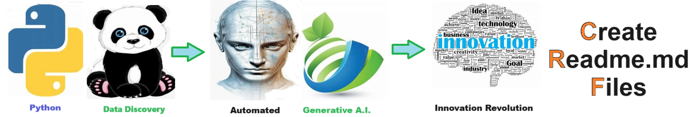

# Create Readme Md - Generate a beautiful and effective readme.md file.
Generate a beautiful and effective readme.md file.

The README.md file is a common practice in software development projects, serving as a user-friendly introduction and guide to the project. Typically written in Markdown format for easy formatting and readability, this file provides essential information about the project, such as its purpose, features, installation instructions, usage guidelines, and contribution guidelines. The README.md file acts as a central hub for stakeholders, including developers, collaborators, and users, to quickly understand the project's goals, functionalities, and how to interact with it effectively. Its primary purpose is to facilitate communication and collaboration, ensuring that everyone involved in the project has access to relevant information and resources to contribute effectively and utilize the project to its fullest potential.

## Getting Started
To get started with the **Create Readme Md** solution repository, follow these steps:
1. Clone the repository to your local machine.
2. Install the required dependencies listed at the top of the notebook.
3. Explore the example code provided in the repository and experiment.
4. Run the notebook and make it your own - **EASY !**
    
## Solution Features
- Easy to understand and use  
- Easily Configurable 
- Quickly start your project with pre-built templates
- Its Fast and Automated

## Notebook Features
- **Self Documenting** - Automatically identifes major steps in notebook 
- **Self Testing** - Unit Testing for each function
- **Easily Configurable** - Easily modify with **config.INI** - keyname value pairs
- **Includes Talking Code** - The code explains itself 
- **Self Logging** - Enhanced python standard logging   
- **Self Debugging** - Enhanced python standard debugging
- **Low Code** - or - No Code  - Most solutions are under 50 lines of code
- **Educational** - Includes educational dialogue and background material
    
## Deliverables or Figures
    
    

## Github    
## https://github.com/JoeEberle/ 

## Email 
## josepheberle@outlook.com 

    

    